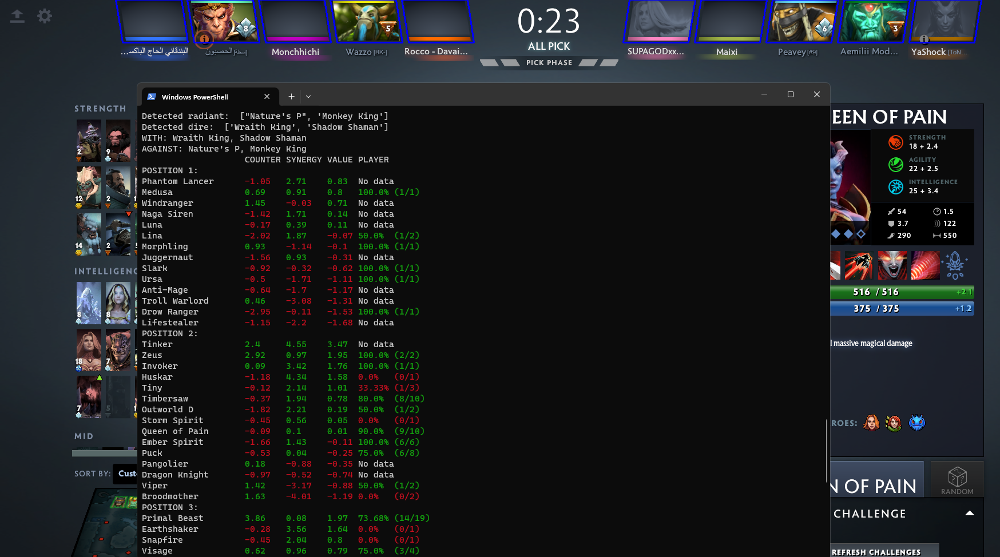

## About

This is a program provides hero suggestions in DotA. First, the highest winrate meta heroes statistics are pulled from [Stratz API](https://stratz.com/api). Then, using OpenCV the picked heroes are detected and matched against hero images downloaded from [OpenDota](https://www.opendota.com/). The images are automatically downloaded in the `images` directory. For each meta hero (and user selected heroes) the matchup statistics are queried. When the suggestions are run, user will be given hero suggestions for each role based on two metrics: counters (how a hero counters each enemy hero) and synergy (how well the hero synergizes with each hero on your team). The two metrics are weighted equally and the suggestions are sorted on this combined metric.

## How To Install

It's advised to use a virtual environment for the packages.

Linux:
* `$ python -m venv .venv`
* `$ .venv\Scripts\activate`
* `$ pip install -r requirements.txt`
* `$ python main.py`

Windows:
* `$ python -m venv .venv`
* `$ source .venv/bin/activate`
* `$ pip install -r requirements.txt`
* `$ python main.py`

## How To Use

* Configure `config.json`:
   * Stratz
     * `token`: set to your Stratz API token found [here](https://stratz.com/api).
     * `cache_meta`: you can choose to cache meta hero data so it's not pulled every time you start the program (will be updated if the data is older than a day).
   * Image detection:
     * `monitor_number`: which monitor is used to display DotA.
     * `screenshot`: either has to be "live" or path to a test image to load instead for testing purposes.
     * `roi_method`: either "predefined" or "contour", determines how hero ROIs are detected. In the future only contour based method will work, however for now I am using predefined coordinates based on my resolution until contour based method is fixed.
   * Steam:
     * `user`: your steam user name.
   * Statistics configuration
     * `bracket`: which bracket should be used for gathering statistics (from "HERALD" to "IMMORTAL").
     * `pickrate_threshold`: the minimum percentage of matches a hero needs to be picked in a role for them to be included in that role.
     * `meta_heroes_count`: how many meta heroes will be considered, it also determines how many hero suggestions for each role are given.
     * `include_heroes`: a list of heroes to be included for each position. These heroes override the meta heroes with lowest win rate. If the hero count is higher than `meta_heroes_count`, only the first respective amount will be used. Note that you need to use code names for heroes, you can obtain corresponding hero names in CLI using `h` command.

* Run:
  * `$ python main.py` (initial load can take a minute because meta hero statistics are pulled first, which takes a while)
  * Launch DotA and find a match.
  * Make sure that the heroes on your screen are visible. Terminal should not overlap with the picks, or open it on another monitor.
  * After the game is loaded, wait until you want to pick (the more heroes are picked before you, the better the suggestions are).
  * In CLI type `r` or `d` if you were drafted on the Radiant team or the Dire team, respectively. The script will detect heroes and give suggestions for each role.

## Features

- [x] Get data from current match
  - [ ] Dota API?
  - [x] Read screen (selected heroes, picked heroes)
- [x] Get meta heroes for each role (based on WR)
- [x] Filter heroes for each role (user input)
- [x] Calculate synergies with each hero and counterpicks against each hero
- [x] Order from highest to lowest predicted winrate for each role
- [ ] Option to cache meta heroes and their matchups (if not older than a day)
- [ ] Detect and filter bans
- [x] Override meta heroes with custom picks
- [ ] Winrate prediction for heroes
- [ ] Show player's WR for suggested heroes
- [ ] Detect lane partners
- [ ] Predict enemy roles
